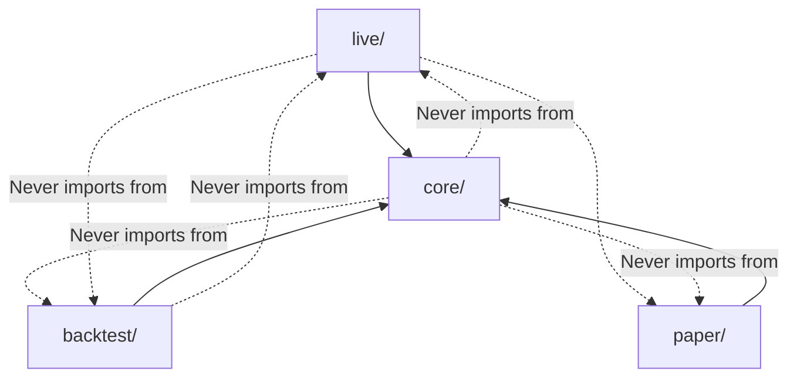
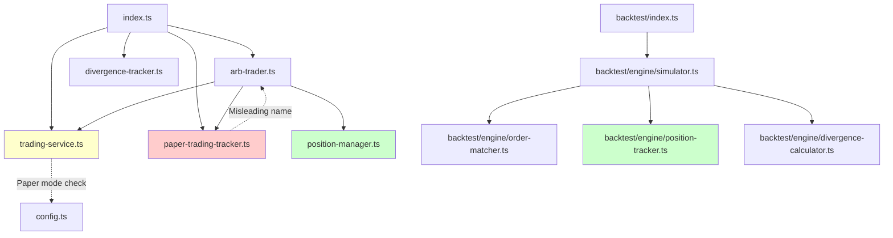
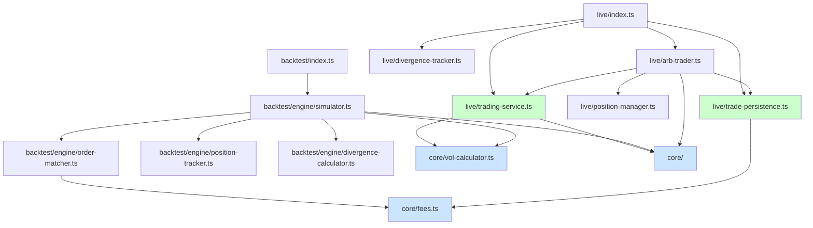

# Architecture Audit: Mode Separation (Backtest / Paper Trading / Live Trading)

**Audit Date:** 2026-02-12
**Auditor:** Claude Code
**Scope:** Full codebase mode separation analysis

---

## Executive Summary

The codebase has **moderate mode separation issues** that could lead to bugs, confusion, and maintenance difficulties. The most critical finding is **conflicting position tracking implementations** and **shared paper trading infrastructure** that serves different purposes in live vs test modes.

**Key Issues:**
- 🔴 **CRITICAL**: Position tracking has two incompatible implementations (`position-manager.ts` vs `backtest/engine/position-tracker.ts`)
- 🔴 **CRITICAL**: `paper-trading-tracker.ts` is used ONLY by live mode but could confuse developers into thinking it's test infrastructure
- 🟡 **WARNING**: Volatility calculation logic is duplicated (live: `volatility-service.ts`, backtest: `simulator.ts` internal methods)
- 🟡 **WARNING**: Divergence tracking has two implementations (correctly separated but conceptually duplicate)
- 🔵 **INFO**: Logger has no explicit namespace separation for modes
- 🔵 **INFO**: `trading-service.ts` contains paper trading checks (should be pure live)

---

## 1. Current Architecture Map

### 1.1 Entry Points

| Mode | Entry Point | Purpose |
|------|------------|---------|
| **Live Trading** | [index.ts](index.ts:1) | Main orchestrator, WebSocket connections, market rotation |
| **Backtest** | [backtest/index.ts](backtest/index.ts:1) | CLI entry point, simulator orchestration, results output |
| **Paper Trading** | N/A (flag) | Not a separate mode—it's `PAPER_TRADING=true` in live mode |

### 1.2 Module Classification

#### 🟢 **BACKTEST-ONLY** (Clear Separation)
| File | Lines | Purpose | Imports From |
|------|-------|---------|--------------|
| `backtest/index.ts` | 537 | CLI entry, config parsing, sweep mode | `./engine/simulator`, `./types`, `./output/*` |
| `backtest/engine/simulator.ts` | 857 | Main backtest engine | Fetchers, OrderMatcher, PositionTracker (backtest), BlackScholesStrategy, DivergenceCalculator |
| `backtest/engine/position-tracker.ts` | 277 | Position tracking for backtest | `../types` |
| `backtest/engine/order-matcher.ts` | ~150 | Trade execution simulation | `../types` |
| `backtest/engine/divergence-calculator.ts` | ~200 | Pre-computed divergence EMA | Chainlink + Binance historical data |
| `backtest/engine/adaptive-adjustment.ts` | ~100 | Adaptive adjustment sweep | N/A |
| `backtest/fetchers/*` | ~1500 | Historical data fetchers | External APIs, cache |
| `backtest/output/*` | ~600 | Result formatting, CSV export | `../types` |
| `backtest/scripts/*` | ~800 | Analysis scripts | Backtest engine |
| `backtest/types.ts` | 314 | Backtest-specific types | None |

#### 🔴 **LIVE-ONLY** (But with mode mixing)
| File | Lines | Purpose | Imports From | Issues |
|------|-------|---------|--------------|--------|
| `index.ts` | 503 | Live orchestrator | ArbTrader, TradingService, paper-trading-tracker, divergence-tracker | ✅ Clean |
| `arb-trader.ts` | 666 | Trading logic | TradingService, PositionManager, paper-trading-tracker | 🟡 Uses paper tracker |
| `trading-service.ts` | 170 | Order execution via CLOB | @polymarket/clob-client, config | 🟡 Has paper mode check (line 48) |
| `position-manager.ts` | 293 | Live position tracking | types | ✅ Clean |
| `divergence-tracker.ts` | 361 | Live EMA divergence | strike-service (Chainlink fetch) | ✅ Clean |
| `resolution-tracker.ts` | ~150 | Pending resolution tracking | None | ✅ Clean |
| `paper-trading-tracker.ts` | 691 | **MISNAMED**: Live paper trade logging | logger, fs | 🔴 Misleading name (see §2.3) |
| `binance-ws.ts` | ~200 | WebSocket price feed | ws | ✅ Clean |
| `orderbook-service.ts` | ~150 | CLOB orderbook fetcher | @polymarket/clob-client | ✅ Clean |
| `redemption-service.ts` | ~200 | On-chain CTF redemption | ethers | ✅ Clean |

#### 🟡 **SHARED/CORE** (Legitimately shared)
| File | Lines | Purpose | Used By | Issues |
|------|-------|---------|---------|--------|
| `config.ts` | 129 | ArbConfig loading | Live only | ✅ Clean |
| `logger.ts` | 363 | Structured logging | All modules | 🔵 No mode namespaces |
| `types.ts` | 68 | Core types | Live + backtest types | ✅ Clean |
| `fair-value.ts` | 106 | **Shim** to strategies/ | All | ✅ Intentional shim |
| `strategies/` | ~400 | Black-Scholes pricing | Live + backtest | ✅ Clean |
| `volatility-service.ts` | 432 | Live vol calculation | Live only | 🟡 Duplicate logic (§2.5) |
| `strike-service.ts` | ~150 | Strike price fetching | Live + divergence-tracker | ✅ Clean |
| `market-finder.ts` | ~150 | Market discovery | Live only | ✅ Clean |
| `telegram.ts` | ~150 | Notifications | Live only | ✅ Clean |
| `execution-metrics.ts` | ~200 | Latency tracking | Live only | ✅ Clean |

---

## 2. Issues Detected

### 2.1 🔴 CRITICAL: Conflicting Position Trackers

**Files:**
- [position-manager.ts:1](position-manager.ts:1) (Live)
- [backtest/engine/position-tracker.ts:1](backtest/engine/position-tracker.ts:1) (Backtest)

**Issue:** Two incompatible implementations with different interfaces and semantics.

#### Side-by-Side Comparison

| Feature | `position-manager.ts` (Live) | `backtest/engine/position-tracker.ts` (Backtest) |
|---------|------------------------------|--------------------------------------------------|
| **State mutation** | Uses `updating` guard flag (line 63) | Immutable (no guard needed) |
| **Position limits** | USD-based (`PositionLimits`) | Share-based (`maxPositionPerMarket` param) |
| **Cost tracking** | Separate `yesCostBasis`, `noCostBasis` | `yesCost`, `noCost` in `MarketPosition` |
| **Resolution** | No resolution logic | `resolve()` method (line 79) |
| **P&L curve** | Calculated on-demand | Tracked in `pnlCurve[]` array |
| **Multi-market** | Single market at a time | Multi-market tracking via `Map<string, MarketPosition>` |
| **Trade recording** | `updatePosition()` (line 122) | `recordTrade()` (line 26) |
| **Fees** | Not tracked | `totalFeesPaid` (line 20) |

**Why this is critical:**
- Developers may confuse which one to use
- Backtest position logic cannot be reused for live trading
- Any "shared" position logic would need to be duplicated

**Root cause:** Live trading uses **incremental, single-market state** while backtest uses **multi-market batch processing**.

---

### 2.2 🔴 CRITICAL: `paper-trading-tracker.ts` Naming Confusion

**File:** [paper-trading-tracker.ts:1](paper-trading-tracker.ts:1)

**Issue:** The name "paper trading tracker" suggests **test infrastructure**, but it's actually a **live mode trade logger** with resolution tracking and Telegram integration.

#### What it actually does:
```typescript
// Used by live trading ONLY (index.ts, arb-trader.ts)
// - Records trades in paper mode (PAPER_TRADING=true)
// - Persists to data/paper-trades/*.json
// - Fetches market outcomes from Polymarket API
// - Triggers on-chain redemption callbacks
// - Sends Telegram notifications
```

**Evidence:**
- [paper-trading-tracker.ts:138](paper-trading-tracker.ts:138) - `onRedemptionNeeded` callback (live-only)
- [paper-trading-tracker.ts:632](paper-trading-tracker.ts:632) - `fetchMarketOutcome()` calls live Polymarket API
- [arb-trader.ts:322](arb-trader.ts:322) - Used in live trading branch
- [arb-trader.ts:464](arb-trader.ts:464) - Records live trades (not paper)

**Why this is misleading:**
- Name suggests it's part of paper trading **mode separation**
- Developers may think this is used by backtest (it's not!)
- Backtest has its own position tracker (`backtest/engine/position-tracker.ts`)

**Correct name:** `live-trade-tracker.ts` or `trade-persistence-service.ts`

---

### 2.3 🟡 WARNING: Duplicate Volatility Logic

**Files:**
- [volatility-service.ts:1](volatility-service.ts:1) (Live)
- [backtest/engine/simulator.ts:638](backtest/engine/simulator.ts:638) (Backtest internal method)

**Issue:** Realized volatility calculation is duplicated.

#### Duplicate Code

**Live version** ([volatility-service.ts:213](volatility-service.ts:213)):
```typescript
private calculateRealizedVol(klines: Kline[]): number {
  if (klines.length < 2) return 0;

  // Calculate log returns (close to close)
  const logReturns: number[] = [];
  for (let i = 1; i < klines.length; i++) {
    const logReturn = Math.log(klines[i].close / klines[i - 1].close);
    logReturns.push(logReturn);
  }

  // Standard deviation of log returns
  const mean = logReturns.reduce((a, b) => a + b, 0) / logReturns.length;
  const variance = logReturns.reduce((sum, r) => sum + Math.pow(r - mean, 2), 0) / (logReturns.length - 1);
  const stdDev = Math.sqrt(variance);

  // Annualize: assuming 1-minute intervals
  const minutesPerYear = 525600;
  const annualizedVol = stdDev * Math.sqrt(minutesPerYear);

  return annualizedVol;
}
```

**Backtest version** ([simulator.ts:638](backtest/engine/simulator.ts:638)):
```typescript
private calculateRealizedVol(klines: BinanceKline[], endIdx: number, windowSize: number): number {
  const startIdx = Math.max(0, endIdx - windowSize);
  const windowKlines = klines.slice(startIdx, endIdx);

  if (windowKlines.length < 2) return 0;

  // Calculate log returns (close to close)
  const logReturns: number[] = [];
  for (let i = 1; i < windowKlines.length; i++) {
    const logReturn = Math.log(windowKlines[i].close / windowKlines[i - 1].close);
    logReturns.push(logReturn);
  }

  if (logReturns.length < 2) return 0;

  // Standard deviation of log returns
  const mean = logReturns.reduce((a, b) => a + b, 0) / logReturns.length;
  const variance = logReturns.reduce((sum, r) => sum + Math.pow(r - mean, 2), 0) / (logReturns.length - 1);
  const stdDev = Math.sqrt(variance);

  // Annualize: assuming 1-minute intervals
  const minutesPerYear = 525600;
  const annualizedVol = stdDev * Math.sqrt(minutesPerYear);

  return annualizedVol;
}
```

**Difference:** Only the window slicing logic differs (live uses full array, backtest uses `endIdx` + `windowSize`).

**Fix:** Extract to `core/vol-calculator.ts` with signature:
```typescript
export function calculateRealizedVol(
  klines: BinanceKline[],
  startIdx: number,
  endIdx: number
): number;
```

---

### 2.4 🟡 WARNING: Divergence Tracking Duplication

**Files:**
- [divergence-tracker.ts:1](divergence-tracker.ts:1) (Live)
- [backtest/engine/divergence-calculator.ts:1](backtest/engine/divergence-calculator.ts:1) (Backtest)

**Issue:** Conceptually duplicate but correctly separated by mode.

| Feature | Live (`divergence-tracker.ts`) | Backtest (`divergence-calculator.ts`) |
|---------|--------------------------------|----------------------------------------|
| Data source | Polls Chainlink every 60s | Pre-loaded historical Chainlink prices |
| EMA calculation | Incremental (running EMA) | Pre-computed per timestamp |
| State | In-memory buffer + persisted | Fully in-memory |
| Window | Rolling 2h | Static 2h lookback |

**Verdict:** This is **acceptable duplication** because:
- Live needs real-time polling
- Backtest needs historical batch processing
- Shared abstraction would be complex for minimal gain

**Recommendation:** Document why these exist separately in both files.

---

### 2.5 🔵 INFO: Logger Has No Mode Namespaces

**File:** [logger.ts:1](logger.ts:1)

**Issue:** All logs go through the same logger with no explicit mode separation.

**Current behavior:**
- `LOG_MODE=dev|live-test|prod` controls level/format
- No namespace for backtest vs live logs

**Example ambiguity:**
```typescript
// Live trading
const log = createLogger('ArbTrader');
log.info('trade.filled', { ... });

// Backtest
console.log('✅ Processed 50 markets');  // Raw console.log!
```

**Recommendation:**
- Backtest: Use `createLogger('Backtest')` consistently
- Live: Use `createLogger('Live')`
- Add `mode` field to all log entries automatically

---

### 2.6 🔵 INFO: Trading Service Contains Paper Mode Check

**File:** [trading-service.ts:48](trading-service.ts:48)

**Issue:** Paper trading check inside live trading service.

```typescript
// Skip CLOB initialization in paper trading mode
if (config.paperTrading) {
  this.initialized = true;
  console.log('[TradingService] Paper trading mode - CLOB client not initialized');
  return;
}
```

**Why this exists:**
- `trading-service.ts` is used by `arb-trader.ts` in both live and paper modes
- Paper mode needs the same code path but without actual CLOB calls

**Verdict:** Acceptable pragmatic solution, but not pure separation.

**Better architecture:**
```
core/trading-interface.ts  ← Interface
live/clob-trading.ts       ← Real implementation
paper/mock-trading.ts      ← Mock implementation
```

---

## 3. Missing Abstractions

### 3.1 Shared Volatility Calculator

**Current:** Duplicated in `volatility-service.ts` and `simulator.ts`

**Proposed:**
```
core/vol-calculator.ts
  - calculateRealizedVol(klines, startIdx, endIdx)
  - calculateLogReturns(klines, startIdx, endIdx)
  - annualizeVolatility(stdDev, intervalMinutes)
```

Used by:
- Live: `volatility-service.ts` wraps with real-time logic
- Backtest: `simulator.ts` calls directly

---

### 3.2 Shared Order Sizing Logic

**Current:** Position limits are USD-based in live (`position-manager.ts`) but share-based in backtest (`simulator.ts` config).

**Proposed:**
```
core/order-sizing.ts
  - calculateOrderSize(config, position, price)
  - checkPositionLimits(config, position, orderSize)
```

---

### 3.3 Shared Fee Calculation

**Current:** Fee calculation is in:
- [paper-trading-tracker.ts:112](paper-trading-tracker.ts:112) (live)
- [backtest/engine/order-matcher.ts](backtest/engine/order-matcher.ts) (backtest)

**Proposed:**
```
core/fees.ts
  - calculatePolymarketFee(shares, price)
```

---

## 4. Proposed Target Architecture

### 4.1 Directory Structure

```
crypto-pricer/
├── core/                       ← Shared business logic (all modes)
│   ├── pricing/
│   │   ├── black-scholes.ts
│   │   ├── fair-value.ts
│   │   └── index.ts
│   ├── vol-calculator.ts       ← Extract from vol-service + simulator
│   ├── order-sizing.ts         ← Extract position limit logic
│   ├── fees.ts                 ← Extract from paper-tracker + order-matcher
│   ├── logger.ts
│   ├── config.ts
│   └── types.ts
│
├── live/                       ← Live trading only
│   ├── index.ts                ← Entry point (current index.ts)
│   ├── arb-trader.ts
│   ├── trading-service.ts      ← Pure live (remove paper check)
│   ├── position-manager.ts
│   ├── divergence-tracker.ts
│   ├── resolution-tracker.ts
│   ├── trade-persistence.ts    ← Rename from paper-trading-tracker.ts
│   ├── binance-ws.ts
│   ├── orderbook-service.ts
│   ├── redemption-service.ts
│   ├── volatility-service.ts   ← Wrapper around core/vol-calculator
│   ├── strike-service.ts
│   ├── market-finder.ts
│   ├── telegram.ts
│   └── execution-metrics.ts
│
├── paper/                      ← Paper trading mode (optional split)
│   └── mock-trading-service.ts ← Mock for CLOB client
│
├── backtest/                   ← Backtesting only
│   ├── index.ts                ← Entry point
│   ├── engine/
│   │   ├── simulator.ts        ← Use core/vol-calculator
│   │   ├── position-tracker.ts
│   │   ├── order-matcher.ts    ← Use core/fees
│   │   ├── divergence-calculator.ts
│   │   └── adaptive-adjustment.ts
│   ├── fetchers/               ← Historical data
│   ├── output/                 ← Results formatting
│   ├── scripts/                ← Analysis tools
│   └── types.ts
│
└── data/                       ← Cached data + logs
```

### 4.2 Dependency Flow



### 4.3 Logger Namespaces

```typescript
// Live trading
const log = createLogger('Live:ArbTrader', { mode: 'live' });
log.info('trade.filled', { ... });
// Output: { level: "info", module: "Live:ArbTrader", mode: "live", event: "trade.filled", ... }

// Backtest
const log = createLogger('Backtest:Simulator', { mode: 'backtest' });
log.info('market.processed', { ... });
// Output: { level: "info", module: "Backtest:Simulator", mode: "backtest", event: "market.processed", ... }
```

---

## 5. Migration Checklist

### Phase 1: Critical Fixes (No Breaking Changes)

- [ ] **Rename `paper-trading-tracker.ts` → `trade-persistence.ts`**
  - Update imports in `index.ts`, `arb-trader.ts`
  - Add comment: `// Live trade persistence (not paper trading mode infrastructure)`

- [ ] **Add mode field to logger**
  - [logger.ts:260](logger.ts:260) - Add `mode` to merged data
  - Live: `createLogger('ArbTrader', { mode: 'live' })`
  - Backtest: Replace console.log with structured logs

- [ ] **Document position tracker split**
  - Add comment to `position-manager.ts`: `// Live trading only - see backtest/engine/position-tracker.ts for backtest`
  - Add comment to `backtest/engine/position-tracker.ts`: `// Backtest only - see position-manager.ts for live`

### Phase 2: Extract Core Modules (Low Risk)

- [ ] **Extract `core/vol-calculator.ts`**
  - Copy `calculateRealizedVol()` from `volatility-service.ts`
  - Refactor to accept `startIdx, endIdx` params
  - Update `volatility-service.ts` to use core version
  - Update `simulator.ts` to use core version

- [ ] **Extract `core/fees.ts`**
  - Move `calculatePolymarketFee()` from `paper-trading-tracker.ts`
  - Update `order-matcher.ts` to import from core

- [ ] **Extract `core/order-sizing.ts`**
  - Extract order size logic from `position-manager.ts`
  - Make it pure function-based

### Phase 3: Directory Reorganization (Breaking Changes)

- [ ] **Create `live/` directory**
  - Move live-only files
  - Update all import paths
  - Test live trading

- [ ] **Create `core/` directory**
  - Move shared files
  - Update all import paths

- [ ] **Update backtest imports**
  - Point to `core/` for shared logic
  - Test backtest

### Phase 4: Trading Service Split (Optional)

- [ ] **Create `paper/mock-trading-service.ts`**
  - Extract mock logic from `trading-service.ts`

- [ ] **Make `trading-service.ts` pure live**
  - Remove paper trading check
  - Use interface + dependency injection

---

## 6. Risk Assessment

| Change | Risk | Impact | Recommendation |
|--------|------|--------|----------------|
| Rename paper-trading-tracker | 🟢 Low | Small | Do immediately |
| Add logger mode field | 🟢 Low | Medium | Do immediately |
| Extract vol-calculator | 🟡 Medium | Medium | Test thoroughly |
| Extract fees | 🟢 Low | Small | Safe |
| Directory reorganization | 🔴 High | Large | Defer to dedicated refactor |
| Trading service split | 🟡 Medium | Medium | Optional enhancement |

---

## 7. Dependency Graph

### Current State


### Proposed State


---

## 8. Conclusion

### Summary of Findings

| Severity | Count | Issues |
|----------|-------|--------|
| 🔴 Critical | 2 | Position tracker duplication, Paper tracker naming |
| 🟡 Warning | 2 | Volatility duplication, Divergence duplication |
| 🔵 Info | 2 | Logger namespaces, Trading service mixing |

### Recommendations Priority

1. **Immediate (This Week):**
   - Rename `paper-trading-tracker.ts` → `trade-persistence.ts`
   - Add mode field to logger
   - Document position tracker split

2. **Short-term (Next Sprint):**
   - Extract `core/vol-calculator.ts`
   - Extract `core/fees.ts`

3. **Long-term (Future Refactor):**
   - Directory reorganization (`live/`, `core/`, `backtest/`)
   - Trading service interface + dependency injection

### Final Verdict

The codebase has **acceptable mode separation** for a project of this size, but the **naming and documentation** issues could lead to confusion as the team grows. The critical fixes are **low-risk, high-impact** and should be done immediately.

---

**End of Audit**
